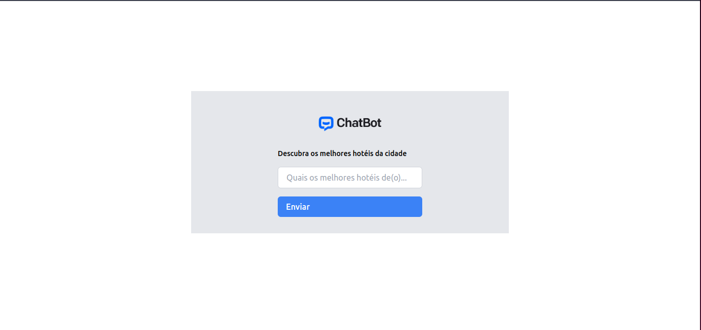

<div align="center">
    
    
</div>

Este ChatBot foi contruído com o intuíto de retornar os melhores hotéis de cada cidade do Brasil baseado nos seus feedbacks encontrado na internet.

### Configuração

Para rodar a aplicação localmente, primeiro crie o arquivo <code>.env</code>.

```shell
cp .env.example .env
 ```

Após isso, abra o <code>.env</code> e coloque sua API KEY do Google aqui:

```
GEMINI_API_KEY=
```

Por útlimo, para desfrutar do ChatBot, rode a aplicação

```shell
php artisan serve
 ```
